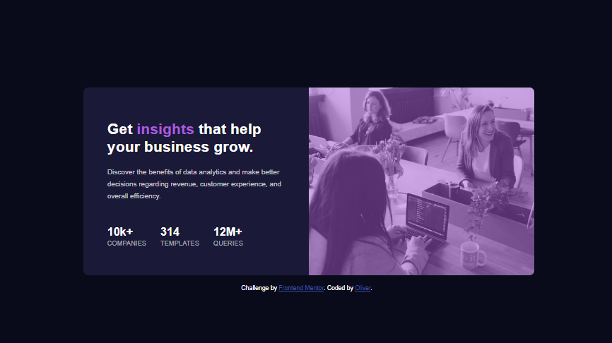

# Frontend Mentor - Stats preview card component solution

This is a solution to the [Stats preview card component challenge on Frontend Mentor](https://www.frontendmentor.io/challenges/stats-preview-card-component-8JqbgoU62). Frontend Mentor challenges help you improve your coding skills by building realistic projects. 

## Table of contents

- [Overview](#overview)
  - [The challenge](#the-challenge)
  - [Screenshot](#screenshot)
  - [Links](#links)
- [My process](#my-process)
  - [Built with](#built-with)
  - [What I learned](#what-i-learned)
  - [Continued development](#continued-development)
  - [Useful resources](#useful-resources)
- [Author](#author)
- [Acknowledgments](#acknowledgments)

## Overview

### The challenge

Users should be able to:

- View the optimal layout depending on their device's screen size

### Screenshot

### Links

- Solution URL: [Add solution URL here](https://your-solution-url.com)
- Live Site URL: [Add live site URL here](https://your-live-site-url.com)

## My process

### Built with

- Semantic HTML5 markup
- CSS custom properties
- Flexbox
- Mobile-first workflow

### What I learned

I learnt a lot during the course of making this stats preview component card but what was most striking was the use of media queries which help us determine and evaluate the apprearance of our design across various devices such as mobile phones, tablets and desktops/laptops. I learnt also that i could make my build view either mobile first or desktop first all depending on my choices.

### Continued development

I will love to be able to experiment more with the media query css function and maybe possible try building mobile first before going for desktop view with all my future projects.

### Useful resources

- [Example resource 1](https://www.example.com) - This helped me for XYZ reason. I really liked this pattern and will use it going forward.

## Author

- Website - [Oliver](https://www.your-site.com)
- Frontend Mentor - [@Gospel33](https://www.frontendmentor.io/profile/Gospel33)
- Twitter - [@Olive_smart8](https://www.twitter.com/Olive_smart8)

## Acknowledgments

My thanks goes both to the amazing BlochChainUNN community for making me come across this project and aswell the FrontEnd Mentor Community for making project like this available for upcoming Devs like me.
